  <table>
    <tr>
      <!-- Profile Image -->
      <td width="50%" align="center">
        
      </td>
      <!-- SVG Stack -->
      <td width="50%" align="center">
        
         
        
      </td>
    </tr>
  </table>

# Alex Coundouriotis

## Summary
B.S. in Computer Science graduate with 9+ years of iOS and Java development, consistently delivering creative solutions and impactful applications. Boasts a track record of 10+ ground-up app builds (6 currently on AppStore), averaging 8k–12k downloads monthly. Leveraged social media channels (TikTok) to grow a following of over 500k and drive 520M+ views. Passionate about AI, GPT integration, and delivering cutting-edge mobile experiences.

---

## Education & Skills
- Bachelor of Science in Computer Science from Kennesaw State University  
- 9+ years of iOS & Java software development  
- 10+ ground-up developed apps (6 currently on the App Store)  
- 8k–12k average monthly downloads  
- Achieved 500k+ followers & 520M+ views on TikTok  

---

## Notable Projects

### [StudyAI Learn With GPT](https://apps.apple.com/us/app/studyai-web-photo-ai-tutor/id1664039953)
• <strong>Tech Stack:</strong> Swift, SwiftUI, CoreData, Java, MySQL, Firebase, Tenjin, GPT, Git  
• <strong>Period:</strong> 2021 – Present  
• 25,000+ lines of Swift & SwiftUI using UIKit & Combine for camera/audio (AVFoundation)  
• Integrated open-source Java GPT Library for live chats, computer vision, and structured outputs  
• Custom Java server for chat interception, MySQL persistence & rate limiting  
• StoreKit 1.0/2.0 server-side receipt & transaction validation with an open-source Java Apple Transaction Client Library  
• 12 Swift packages (including an open-source face animation library, Firebase, MMPs)  
• Averages 5–10k monthly downloads, 130k+ chats, 880 reviews (4.8 star average)  

### [ChefApp AI Recipe Maker](https://apps.apple.com/us/app/chefapp-ai-recipe-creator/id6450523267)
• <strong>Tech Stack:</strong> Swift, SwiftUI, CoreData, Java, MySQL, Firebase, Tenjin, GPT, Git  
• <strong>Period:</strong> 2022 – Present  
• GPT Structured Output to generate JSON recipes from fridge/pantry images  
• Bing Image Search API for recipe images, TikAPI for relevant recipe videos  
• Universal Links for recipe sharing & Java/MySQL for backend ID-based downloads  
• Share Extension for importing recipes from video transcription (OpenAI Whisper), websites, or images  
• 15,000+ lines of Swift & Java, using HTTPS and WebSocket with local (CoreData)/remote (MySQL) persistence  

### [Java GPT Client - Open Source](https://github.com/Condo97/Java-GPT-Client-OAIGPTConnector)
• <strong>Tech Stack:</strong> Java, GPT-4 + Structured Outputs, JUnit Jupiter, Jackson, Git  
• <strong>Period:</strong> 2022 – Present  
• Open-source Java GPT & OpenAI library for real-time chats, structured outputs, image creation, and audio transcription  
• WebSocket support for live chats plus RESTful API usage  
• Annotation framework for structured output POJOs—encode and decode structured responses  

---

## Corporate Experience

### GreenSky: Software Developer (2017–2019)
• Swift, Objective-C, CoreData, UIKit, MS SQL, Agile/Scrum, Jira, Git  
• Led iOS codebase upgrade from Objective-C to Swift with adaptive UIKit interfaces  
• Participated in daily scrums, wrote proposals, collaborated with QA, and facilitated production releases  
• Handled sensitive data (SSN, credit cards, addresses) with confidentiality and compliance  

### GreenSky: Software Development Intern (2017)
• Swift, Objective-C, CoreData, UIKit, Jira, Git  
• Delivered PDF417 ID scanner for fast autofill on customer loan applications  
• Contributed to conversion from Objective-C to Swift upon rapid completion of initial tasks  
• Demonstrated flexibility: learned Objective-C on the job and moved to professional Swift development  

---

## Other Freelance Projects

• <strong>SQL Componentizer</strong> (Java, MySQL, Open Source) – Serialize/deserialze Java objects & enums to MySQL via annotations and builder patterns.  
• <strong>Apple Transaction Client</strong> (Java, MySQL, Open Source) – Early StoreKit 2.0 transaction validation library, alternative to RevenueCat.  
• <strong>Call AI</strong> (Swift, SwiftUI, Java, MySQL, Google Analytics, Tenjin) – Simple OpenAI Realtime API WebSocket client/server with speech and transcription.  
• <strong>2024AI+CODE</strong> (Swift, SwiftUI, Java, Python, MySQL, ChatGPT, GPT Function Calling) – MacOS code editor leveraging GPT for multi-file actions and code suggestions.  
• <strong>AI+Vision</strong> (Swift, SwiftUI, Java, MySQL, Google Analytics, Tenjin) – Rapidly built AI camera control app integrated with existing open-source libraries.  
• <strong>Barback AI Drink Maker</strong> (Swift, SwiftUI, Java, MySQL, Google Analytics, Tenjin) – Creates drink mixes from a photo of a user’s home bar, meant as a 30-day SwiftUI challenge.  

---

## Links

### App Store
- [StudyAI](https://apps.apple.com/us/app/studyai-web-photo-ai-tutor/id1664039953)  
- [ChefApp](https://apps.apple.com/us/app/chefapp-ai-recipe-creator/id6450523267)
- [Barback](https://apps.apple.com/us/app/barback-ai-drink-crafter/id6466750022)
- [AI+Vision](https://apps.apple.com/us/app/ai-vision-see-with-ai/id6479183759)
- [CallAI](https://apps.apple.com/us/app/call-ai-simple-voice-chat/id6739984942)
- [SuppSnap](https://apps.apple.com/us/app/suppsnap-analyze-supplements/id6739546193)

### GitHub
- [Profile](https://github.com/Condo97)
- [Java GPT Client](https://github.com/Condo97/Java-GPT-Client-OAIGPTConnector)  
- [StudyAI iOS](https://github.com/Condo97/StudyAI-iOS)  
- [StudyAI Server](https://github.com/Condo97/WriteSmith-Server)  
- [ChefApp iOS](https://github.com/Condo97/ChefApp-SwiftUI-Public)  
- [ChefApp Server](https://github.com/Condo97/ChefApp-Server)  
- [SQLComponentizer](https://github.com/Condo97/SQLComponentizer)

---

## Skills & Proficiencies

### Languages & Technologies
• Swift • SwiftUI • Java • Python • MySQL • Git • Maven  
• Swift Package Manager (SPM) • ChatGPT • GPT Function Calling  
• Google Analytics • Mobile Measurement Partner (MMP) • SSL  

### Experience
• iOS & Mobile App Development  
• Full Stack & Backend Development  
• AI & API Integration  
• Front-End Development & Client-Server Architecture  
• Multi-File Code Planning & Function Refactoring  
• Open Source Libraries  

### Tools & Platforms
• Visual Studio & VSCode • Xcode • IntelliJ • Eclipse  
• Git/GitHub • Shopify • TikTok Shop  
• Facebook Ads Manager • Google Analytics • Firebase Analytics  

### Project Management
• Agile & Scrum • Requirement Analysis • Code Reviews  
• Version Control • Cross-Functional Collaboration  

### Soft Skills
• Problem Solving • Critical Thinking • Team Collaboration  
• Project Management • Communication • Time Management  

### Miscellaneous
• HTTPS / WebSocket Secure (WSS) • GPT Camera Control  
• In-App Purchases • UX/UI • Modular Code Development  
• Data Analytics  

---

> Ready to craft the next big thing in AI-driven mobile solutions? Let’s connect and collaborate on innovative, user-centric experiences. Feel free to reach out via email or phone for any iOS, AI, or full stack projects!
