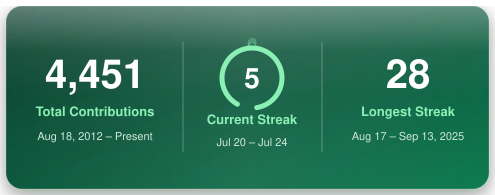

<table>
  <tr>
    <td width="30%" align="center">
      
    </td>
    <td width="60%" align="center">
      
    </td>
</tr>
</table>

# Alex Coundouriotis

## Summary
Senior iOS & full-stack engineer, 9 years shipping production software — AI-augmented by design: architecture, constraints, and verification gates, with coding agents doing the typing. I build and operate production LLM systems (multi-provider routing, guardrails, RAG, evals, cost telemetry) and the agent infrastructure around them. 10+ apps shipped to the App Store under my own studio. Everything here is checkable.

---

## Currently
**Reframe (Glucobit, Inc.) — iOS & Full-Stack Engineer (2025 – Present)**
- Production LLM infrastructure on serverless Node.js / AWS Lambda: multi-provider model routing with failover, prompt guardrails, RAG, per-request cost & cache telemetry
- SwiftUI modernization of a large legacy UIKit codebase — multiple large-scale surface rewrites, full backward compatibility
- Unified real-time messaging platform across six conversation types; widgets & Live Activities; Stripe/RevenueCat monetization

---

## Notable Projects

### [StudyAI - Web & Photo AI Tutor](https://apps.apple.com/us/app/studyai-web-photo-ai-tutor/id1664039953)
• <strong>Tech Stack:</strong> Swift, SwiftUI, CoreData, Java, MySQL, Firebase, Tenjin, GPT, Git  
• <strong>Period:</strong> 2021 – Present · live on the App Store since January 2023  
• ~86,000 lines of Swift, 26-entity Core Data model, watchOS companion, realtime voice  
• Integrated open-source Java GPT Library for live chats, computer vision, and structured outputs  
• Custom Java backend (~32K lines) with StoreKit 2 server-side JWS verification  
• 870+ ratings (4.75 star average)  

### [ChefApp AI Recipe Maker](https://apps.apple.com/us/app/chefapp-ai-recipe-creator/id6450523267) ([github](https://github.com/Condo97/ChefApp-SwiftUI-Main/tree/main))
• <strong>Tech Stack:</strong> Swift, SwiftUI, CoreData, Java, MySQL, Firebase, Tenjin, GPT, Git  
• GPT Structured Output to generate JSON recipes from fridge/pantry images  
• Share Extension for importing recipes from video transcription (OpenAI Whisper), websites, or images  
• Universal Links for recipe sharing & Java/MySQL backend  

### [Java GPT Client - Open Source](https://github.com/Condo97/Java-GPT-Client-OAIGPTConnector)
• Open-source Java GPT & OpenAI library for real-time chats, structured outputs, image creation, and audio transcription  
• WebSocket support for live chats plus RESTful API usage  
• Annotation framework for structured output POJOs—encode and decode structured responses  

---

## Open Source
- **Merged PRs on third-party open-source Swift projects** — an event-handling fix in an OpenAI realtime API client ([m1guelpf/swift-realtime-openai](https://github.com/m1guelpf/swift-realtime-openai)) and undo support in a Swift code-editor component ([ZeeZide/CodeEditor](https://github.com/ZeeZide/CodeEditor)) — reviewed and merged by external maintainers
- **Apple Transaction Client** — early StoreKit 2 server-side validation library, an open-source alternative to RevenueCat
- **SQL Componentizer** — annotation-based Java POJO ↔ SQL micro-ORM

---

## Corporate Experience

### GreenSky: Software Developer (2017–2019)
• Led iOS codebase upgrade from Objective-C to Swift with adaptive UIKit interfaces  
• Delivered PDF417 driver's-license scanner for loan-application autofill, released to production  
• Trusted with PII (SSN, credit cards, addresses) in a regulated fintech environment  

---

## Links

### App Store
- [StudyAI](https://apps.apple.com/us/app/studyai-web-photo-ai-tutor/id1664039953)  
- [ChefApp](https://apps.apple.com/us/app/chefapp-ai-recipe-creator/id6450523267)
- [Barback](https://apps.apple.com/us/app/barback-ai-drink-crafter/id6466750022)
- [AI+Vision](https://apps.apple.com/us/app/ai-vision-see-with-ai/id6479183759)
- [CallAI](https://apps.apple.com/us/app/call-ai-simple-voice-chat/id6739984942)
- [SuppSnap](https://apps.apple.com/us/app/suppsnap-analyze-supplements/id6739546193)

### GitHub
- [Profile](https://github.com/Condo97)
- [Java GPT Client](https://github.com/Condo97/Java-GPT-Client-OAIGPTConnector)  
- [StudyAI iOS](https://github.com/Condo97/StudyAI-iOS)  
- [StudyAI Server](https://github.com/Condo97/WriteSmith-Server)  
- [ChefApp iOS](https://github.com/Condo97/ChefApp-SwiftUI-Public)  
- [ChefApp Server](https://github.com/Condo97/ChefApp-Server)  
- [SQLComponentizer](https://github.com/Condo97/SQLComponentizer)

---

## Skills & Proficiencies

### Languages & Technologies
• Swift • SwiftUI • UIKit • TypeScript • Python • Java • Objective-C • SQL • GraphQL  
• OpenAI + Anthropic APIs • RAG • structured outputs • function calling • evals • prompt guardrails • model routing • MCP • agent orchestration  
• Core Data • Combine • Swift Concurrency • WidgetKit • ActivityKit • StoreKit 2 • AVFoundation • XCTest • SPM  
• AWS Lambda • Node.js • PostgreSQL • MySQL • Redis • REST • WebSocket • Docker • GitHub Actions  

### Experience
• iOS & Mobile App Development  
• Full Stack & Backend Development  
• Production LLM Systems & AI-Augmented Engineering  
• Front-End Development & Client-Server Architecture  
• Open Source Libraries  

### Tools & Platforms
• Xcode • VSCode • IntelliJ  
• Git/GitHub • Shopify  
• Google Analytics • Firebase  

### Project Management
• Agile & Scrum • Requirement Analysis • Code Reviews  
• Version Control • Async Remote Collaboration  

---

> Building production LLM systems and the guardrails that make them trustworthy — routing, evals, cost control. 9 years shipping iOS and full-stack. Everything here is checkable — reach out via email or phone.
